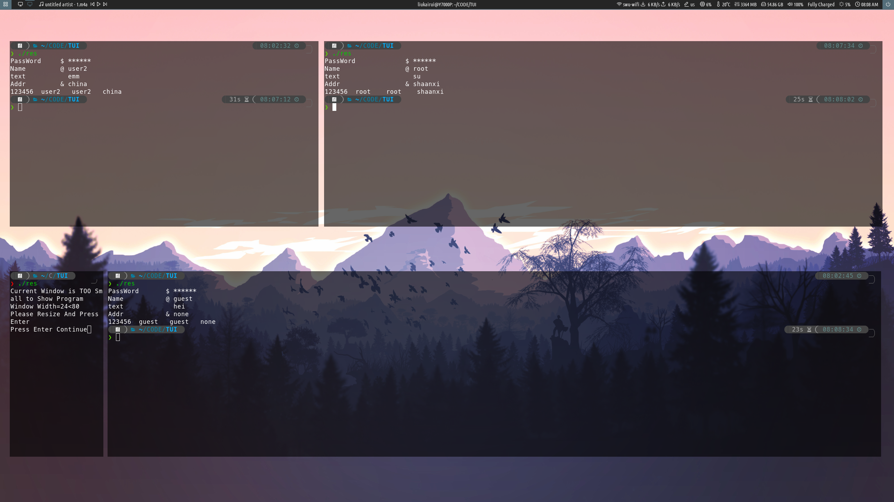
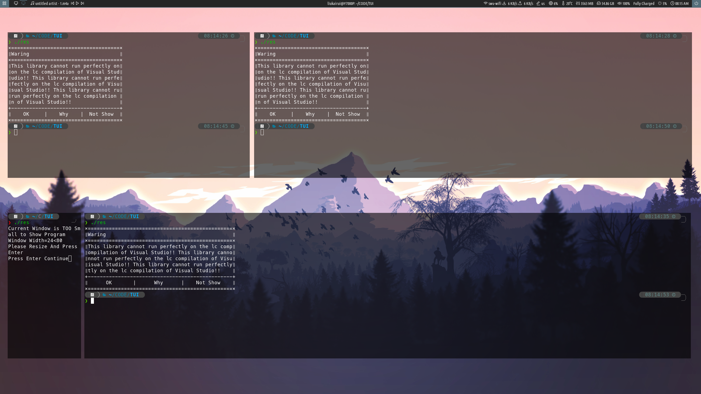

 

# TUIStyle

一个C++下的仿BootStrap的TUI(Text User Interface)样式库，即让C++开发者在终端下可以较为轻松的输出BootStrap部分样式的样式库。


## 实现的功能

- 响应式栅格布局系统
- 有序与无序列表
- 描述
- 输入框(写的有点差劲)
- 弹出框
- 菜单栏(写的与预期相差甚远)

所以，你可以 认为这只是实现了一个栅格布局

## 平台兼容性

- Linux 平台：g++编译后可以正常运行

- Windows平台：在改进兼容性后 g++编译后部分字符`Terminal(UWP)`**不**适配 `powershell` **不**适配  `cmd`适配 直接运行exe程序适配. Virsual Stdio的`lc`编译**不**适配


## 使用方法

### 引入

- 把有文件与c++源文件放到工程目录下，添加头文件引用

- 在您项目的main函数首行写下`encode_Fix();`来刷新终端使用utf8编码

### 调用栅格布局

构造这个库的初衷是希望帮开发者构造一些样式，由于我不知道开发者需要用什么样的形式展现内容，我们尽量将所有的结果都作为字符串返回给开发者，由开发者输出。

在栅格布局中，一行被分割成了12列，您可以用`text_X("text",padding,width of lg,width of md，width of sm)`的方式调用函数输出一个固定宽的盒子。

- `X`可选`L`,`M`,`R`表示文本居左，中，右

- `"text"`是您希望盒子中的内容，类型为字符串

- `padding`表示文本与盒子边缘距离(`L`与`M`时为左边距，`R`时为右边距)，接受负数，类型为整形，若接收值为负数，文本会向相反方向便宜，允许越界，同时允许之后的元素覆盖之前的元素

- 如果文本的内容过长且不是因为`padding`过大引起的，系统将为文本添加省略号保证文本在元素内部

- 您可以使用`new_Line()`手动开启新的一行，如果你没有手动开启，但是元素放不下了，系统会自动进行换行

  。如果一行元素总宽度不足整行宽，但是`new_Line()`被手动调用，系统会自动使用空格补齐空白

- 您可以使用`make_Inrline()`与`make_Outline()`分别得到一个内外横向边框

- 您可以使用`text(string)`得到一个长度不受约束的盒子。

- 在使用前后加入`begin_Table()`,`end_Table()`可以为盒子自动加上左右边框与首位部的边框，如果想要自定义请不要使用这两个命令

例如：

```cpp
int demo_1(){
    cout<<make_Text("Grid layout automatically avoids context");
    cout
        <<begin_Table()
                <<text_M("Here is a demo for Grid layout",0,12,12,12)
            <<new_Line()
            <<make_Inrline()
                <<text_M("different width",0,12,12,12)
            <<new_Line()
                <<text_L("1/12",0,1,1,1)
                <<text_L("1/6",0,2,2,2)
                <<text_L("1/3",0,4,4,4)
                <<text_L("5/12",0,5,5,5)
            <<new_Line()
            <<make_Inrline()
                <<text_M("different Position",0,12,12,12)
            <<new_Line()
                <<text_L("Left",0,4,4,4)
                <<text_M("Middle",0,4,4,4)
                <<text_R("Right",0,4,4,4)
            <<new_Line()
            <<make_Inrline()
                <<text_M("Postive&negative offset",0,12,12,12)
            <<new_Line()
                <<text_M("Middle -2",-2,3,3,3)
                <<text_M("Middle +2",2,3,3,3)
                <<text_M("Space",0,3,3,3)
                <<text_L("Left -2",-2,3,3,3)
                <<text_L("Left +2",2,3,3,3)
                <<text_R("Right +2",2,3,3,3)
                <<text_R("Right -2",-2,3,3,3)
                <<text_M("bound Allow",0,3,3,3)
            <<new_Line()
            <<make_Inrline()
                <<text_M("overfall hide & auto complete & auto wrap",0,12,12,12)
                <<text_L("Long Text Long Text Long Text Long Text Long Text ",0,4,4,4)
                <<text_L("Long Text Long Text Long Text Long Text Long Text ",0,4,4,4)
                <<text_L("Auto Wrap Auto Wrap Auto Wrap Auto Wrap Auto Wrap  ",0,4,4,4)
                <<text_L("auto complete auto complete auto complete auto complete",0,4,4,4)
        <<end_Table();
    return 0;
}
```


## 调用列表

- 输入`begin_List("XX")`进入列表环境，`XX`可选`ul`表示无序列表，`ol`表示有序列表
- 列表中的一条使用`make_List("text")`获得
- 输入`end_List()`结束列表环境，列表允许嵌套，不同层级的无需列表样式不同

例如：

```cpp
int demo_2(){
    cout<<make_Text("Grid layout automatically avoids context");
    cout
        <<begin_List("ul")
            <<make_List("aaaaaaaaaaaaa")
            <<make_List("bbbbbbbbbbbbb")
            <<begin_List("ol")
                <<make_List("cccccccccccc")
                <<make_List("dddddddddddd")
                <<begin_List("ul")
                    <<make_List("eeeeeeeeeeee")
                    <<make_List("ffffffffffff")
                    <<make_List("gggggggggggg")
                    <<make_List("hhhhhhhhhhhh")
                <<end_List()
                <<make_List("iiiiiiiiiiii")
                <<make_List("jjjjjjjjjjjj")
            <<end_List()
            <<make_List("kkkkkkkkkkk")
            <<make_List("lllllllllll")
        <<end_List();
    return 0;
}
```


## 描述

类似于名词解释，就像`--help`的界面一样

- `make_Describ(word,describ)` 参数分别为名词，描述
- `make_Long_Describ(word,describ)` 适用于解释较长的描述，参数分别为名词，描述

例如：

```cpp
int demo_3(){
    cout<<make_Describ("BootStrap","A free and open-source CSS framework directed at responsive, mobile-first front-end web development. It contains CSS- and (optionally) JavaScript-based design templates for typography, forms, buttons, navigation, and other interface components.Bootstrap is the seventh-most-starred project on GitHub, with more than 142,000 stars, behind freeCodeCamp (almost 312,000 stars) and marginally behind Vue.js framework.[2]");
    cout<<make_Long_Describ("BootStrap","Bootstrap is a web framework that focuses on simplifying the development of informative web pages (as opposed to web apps). The primary purpose of adding it to a web project is to apply Bootstrap's choices of color, size, font and layout to that project. As such, the primary factor is whether the developers in charge find those choices to their liking. Once added to a project, Bootstrap provides basic style defin");
    return 0;
}
```


### 输入框

绘制一个输入框返回输入的字符串，对于密码有`*`替换

- `load_Input(text,type,len)` : `text`想让终端上现实的提示信息，`type`输入类型，`len`输入框长度

  type可选`normal`,`username`,`password`,`自定义`，表示：不显示标志，显示`@`, 显示`$`, 显示自定义标志

例如：

```cpp
int demo_4(){
    string a,b,c,d;
    a=load_Input("PassWord","password",10);
    b=load_Input("Name","username",10);
    c=load_Input("text","normal",10);
    d=load_Input("Addr","&",10);
    cout<<a<<"\t"<<b<<"\t"<<b<<"\t"<<d<<endl;
    return 0;
}
```



### 弹出框

显示信息与选项(0-4个)

- `make_Check_Box(title,msg,butA,butB,butC,butD)` 分别为标题,消息,四个选项的值(可不写)

```cpp
int demo_5(){
    cout<<make_Check_Box("Waring","This library cannot run perfectly on the lc compilation of Visual Studio!! This library cannot run perfectly on the lc compilation of Visual Studio!! This library cannot run perfectly on the lc compilation of Visual Studio!!","OK","Why","Not Show");
    return 0;
}
```



### 菜单栏

打印菜单，对输入做简单判断，然后返回输入值，本来是想直接用函数指针数组实现一个完整版本的，奈何能力不足

`load_Menu(text,len)` 参数为菜单内容的string数组与菜单长度

例如

```cpp
int demo_6(){
    string tmp[]={
        "You can choose me",
        "You can choose me",
        "You can choose me",
        "You can choose me",
        "You can choose me",
        "You can choose me",
    };
    cout<<load_Menu(tmp,6);
    return 0;
}
```


## 存在问题

- Windows下由于终端默认GB2312所以需要修改编码，但是效果还是不满意，用VS的lc编译效果奇差，所以检测到环境为VS自动警告
- 输入框与菜单栏效果很差，`C++`语法学的不是很扎实，有点不会写
- Clion的自带终端无法检测到大小，以至于媒体查询结果一直为0

## 不错的点

- 较完整的实现了栅格布局
- 通过12个预处理命令对Linux与Windows进行了分别适配